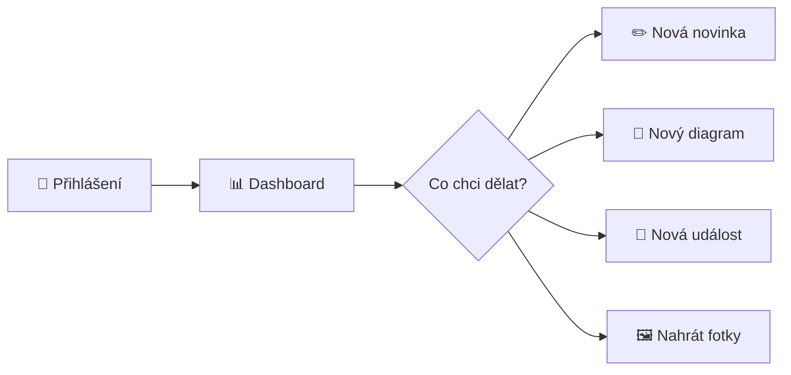
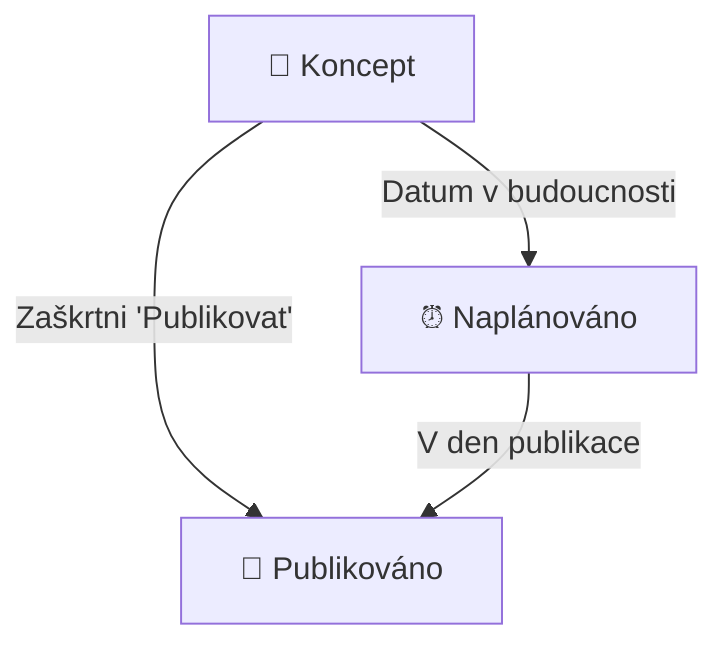

# 🏆 Administrátorský manuál
## Webové stránky ŠO TJ Bižuterie Jablonec

<div align="center">


</div>

---

## � Rychlý start



---

## 📚 Kapitoly

| Kapitola | Popis |
|:--------:|-------|
| [1️⃣ Dashboard](#1️⃣-dashboard) | Přehled a navigace |
| [2️⃣ Editor novinek](#2️⃣-editor-novinek) | Psaní článků |
| [3️⃣ Šachové diagramy](#3️⃣-šachové-diagramy) | Hádanky a pozice |
| [4️⃣ Kniha diagramů](#4️⃣-kniha-diagramů) | Více diagramů v článku |
| [5️⃣ Správa událostí](#5️⃣-správa-událostí) | Turnaje a tréninky |
| [6️⃣ Galerie](#6️⃣-galerie) | Fotografie |

---

## 1️⃣ Dashboard

Dashboard je váš hlavní přehled - vidíte zde všechny články a rychlé akce.

### Rychlé akce

| Tlačítko | Akce | Zkratka |
|:--------:|------|:-------:|
| ➕ Nová novinka | Vytvoří prázdný článek | `N` |
| 🧩 Nový diagram | Otevře editor diagramů | `D` |

> [!TIP]
> **Pro-tip:** Použijte klávesové zkratky pro rychlejší práci!

---

## 2️⃣ Editor novinek

### Struktura článku

```
┌─────────────────────────────────────────┐
│  📝 NADPIS                              │
├─────────────────────────────────────────┤
│  📁 Kategorie  │  📅 Datum  │  👤 Autor │
├─────────────────────────────────────────┤
│                                         │
│  📄 OBSAH ČLÁNKU                        │
│     (WYSIWYG editor)                    │
│                                         │
├─────────────────────────────────────────┤
│  📷 Náhledový obrázek                   │
└─────────────────────────────────────────┘
```

### WYSIWYG Panel nástrojů

| Ikona | Název | Co dělá |
|:-----:|-------|---------|
| **B** | Tučně | Zvýrazní vybraný text tučně |
| _I_ | Kurzíva | Nakloní text |
| H2 | Nadpis 2 | Velký nadpis sekce |
| H3 | Nadpis 3 | Menší podnadpis |
| � | Odkaz | Vloží hypertextový odkaz |
| 📋 | Seznam | Odrážkový seznam |
| 📦 | Sbalitelný | Blok co se dá rozbalit/sbalit |
| 💡 | Info box | Zvýrazněný box s pozadím |
| 🧩 | Diagram | Vloží šachový diagram |
| �️ | Obrázek | Vloží fotku do textu |
| 📊 | Tabulka | Vloží tabulku |

### Zvýraznění textu

```
Před:  "Novák Jan vyhrál 2:0"
Po:    "[Novák Jan] vyhrál [2:0]"
        ↑ zlaté      ↑ zelené
```

Jak na to:
1. Vyberte text myší
2. Klikněte na ikonu **👤** (jméno) nebo **🏆** (skóre)

> [!IMPORTANT]
> **Zvýraznění se hodí pro:**
> - Jména hráčů → zlatá barva
> - Výsledky a skóre → zelená barva

### Stavy publikace



| Stav | Ikona | Kdy se zobrazí veřejně |
|------|:-----:|------------------------|
| Koncept | 📝 | Nikdy |
| Naplánováno | ⏰ | V nastavený den |
| Publikováno | 🚀 | Ihned |

---

## 3️⃣ Šachové diagramy

### Co je diagram?

Diagram je interaktivní šachovnice, kde návštěvník může:
- **Hádanka:** Hádat správný tah (s řešením)
- **Pozice:** Jen prohlížet pozici (bez řešení)

### Vytvoření diagramu

```
┌──────────────────────────────────────────────┐
│  1. Otevři Game Recorder                     │
│     → /game-recorder.html                    │
├──────────────────────────────────────────────┤
│  2. Nastav pozici                            │
│     → FEN notace NEBO přetahování figurek    │
├──────────────────────────────────────────────┤
│  3. Vyplň název a kdo je na tahu             │
├──────────────────────────────────────────────┤
│  4. (Volitelné) Přidej řešení                │
│     → Zadej správné tahy                     │
├──────────────────────────────────────────────┤
│  5. Ulož diagram                             │
└──────────────────────────────────────────────┘
```

### Formát řešení

```
Příklad: Bílý dá mat ve 2 tazích

Řešení: "Qh7+, Kf8, Qh8#"
         ↑      ↑     ↑
         1.tah  odpověď  2.tah
```

> [!NOTE]
> Systém automaticky kontroluje, jestli hráč táhne správně podle zadaného řešení.

---

## 4️⃣ Kniha diagramů

### Co je kniha?

Kniha = více diagramů v jednom bloku s navigačními šipkami

```
     ┌─────────────────┐
     │   ♟ Šachovnice  │
     │                 │
     │  ◀  ● ○ ○  ▶   │  ← navigace mezi diagramy
     │   Bílý na tahu  │
     │  "1 / 3"        │
     └─────────────────┘
```

### Vytvoření knihy

1. V editoru klikni 🧩 **Vložit diagram**
2. Zaškrtni ☑️ **Více najednou**
3. Vyber 2+ diagramy (kliknutím)
4. Klik **Vložit jako knihu**

### Úprava knihy

| Akce | Jak |
|------|-----|
| Zobrazit toolbar | Klik na diagram |
| Změnit diagramy | **Dvojklik** na diagram |
| Přesunout vlevo | Tlačítko ⬅️ v toolbaru |
| Přesunout na střed | Tlačítko ⬜ v toolbaru |
| Přesunout vpravo | Tlačítko ➡️ v toolbaru |
| Smazat | Tlačítko 🗑️ v toolbaru |

### Jak vypadá na webu

```
DESKTOP (šířka > 600px)          MOBIL (šířka ≤ 600px)
┌────────────────────────┐       ┌──────────────────────┐
│ Text článku            │       │ Text článku          │
│ obtéká kolem        ╔══╧══╗    ├──────────────────────┤
│ diagramu            ║  ♟  ║    │                      │
│ který je            ║     ║    │    ♟ CELÁ ŠÍŘKA     │
│ plovoucí            ╚═════╝    │                      │
│ vpravo...              │       ├──────────────────────┤
└────────────────────────┘       │ ...pokračování textu │
```

### Puzzle Badge

Diagramy s řešením mají zlatý odznak:

```
        ╔═══════════════╗
    ┌───╢ 🧩            ║ ← Odznak "Puzzle"
    │   ╚═══════════════╝    vyčnívá z rohu
    │  ┌─────────────────┐
    │  │   ♟ Šachovnice  │
    │  │                 │
    └──┴─────────────────┘
```

---

## 5️⃣ Správa událostí

### Typy událostí

| Typ | Ikona | Příklad |
|-----|:-----:|---------|
| Turnaj | 🏆 | Josefův Důl Open |
| Trénink | 📚 | Oddílový trénink |
| Soustředění | ⛺ | Letní soustředění |
| Zápas | ⚔️ | Krajský přebor |

### Přidání události

1. Přejdi na záložku **Události**
2. Vyplň formulář:
   - 📝 Název
   - 📅 Datum a čas
   - 📍 Místo (automaticky se spočítá vzdálenost od Jablonce)
   - 🏷️ Kategorie a tagy

> [!TIP]
> Zaškrtni **Pouze pro členy** pro interní schůzky co nevidí veřejnost.

---

## 6️⃣ Galerie

### Nahrávání fotek

```
1. Záložka "Galerie"
2. Klik "Nahrát obrázky"
3. Vyber soubory (možno více)
4. Přiřaď kategorii
```

### Kategorie

| Kategorie | Použití |
|-----------|---------|
| **Novinky** | Fotky do článků |
| **Členové** | Profilové fotky |
| **Úvodní** | Hlavní stránka |
| **Bličáky** | Fotky z bličáků |

### Hromadné operace

```
☑️ Foto 1    ☑️ Foto 2    ☐ Foto 3
             ↓
    ┌─────────────────────────┐
    │  Změnit kategorii: [▼]  │
    │  🗑️ Smazat vybrané      │
    └─────────────────────────┘
```

---

## ⚡ Klávesové zkratky

| Zkratka | Akce |
|:-------:|------|
| `N` | Nový článek |
| `D` | Nový diagram |
| `Ctrl+B` | Tučně |
| `Ctrl+I` | Kurzíva |
| `Ctrl+Z` | Zpět |
| `Ctrl+Y` | Vpřed |

---

## 🆘 Řešení problémů

### Diagram nereaguje na kliknutí

```
Problém: Klikám na figurku a nic se neděje
Řešení:
  1. ✓ Zkontroluj že má diagram řešení
  2. ✓ Obnov stránku (Ctrl+Shift+R)  
  3. ✓ Zkus znovu vložit diagram
```

### Obrázek se nenahrává

```
Problém: Nahrávám fotku ale chyba
Řešení:
  1. ✓ Max velikost 10MB
  2. ✓ Formáty: JPG, PNG, WEBP
  3. ✓ Zkus jiný prohlížeč
```

### Změny se neprojevují

```
Problém: Uložil jsem ale na webu nic
Řešení:
  1. ✓ Vyčisti cache (Ctrl+Shift+R)
  2. ✓ Počkej 1-2 minuty (deploy)
  3. ✓ Podívej se do changelogu
```

---

<div align="center">

📧 **Potřebujete pomoc?** Kontaktujte technickou podporu.

---

*Manuál verze 1.0 | Aktualizováno: 22. ledna 2026*

</div>
