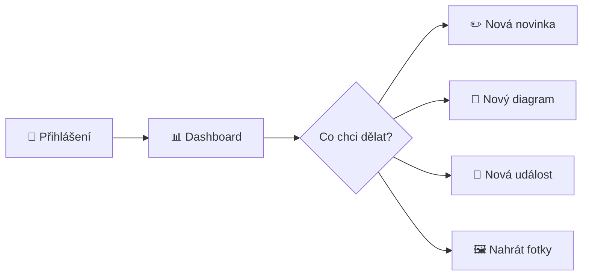
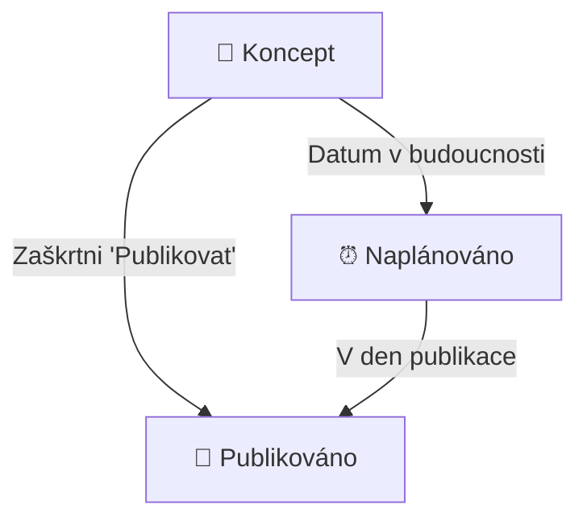

# 🏆 Administrátorský manuál
## Webové stránky ŠO TJ Bižuterie Jablonec

<div align="center">


</div>

---

## 🚀 Rychlý start


```mermaid
flowchart LR
    A[🔐 Přihlášení] --> B[📊 Dashboard]
    B --> C{Co chci dělat?}
    C --> D[✏️ Nová novinka]
    C --> E[🧩 Nový diagram]
    C --> F[📅 Nová událost]
    C --> G[🖼️ Nahrát fotky]
```

---

## 📚 Kapitoly

| Kapitola | Popis |
|:--------:|-------|
| [1️⃣ Dashboard](#1️⃣-dashboard) | Přehled a navigace |
| [2️⃣ Editor novinek](#2️⃣-editor-novinek) | Psaní článků |
| [3️⃣ Šachové diagramy](#3️⃣-šachové-diagramy) | Hádanky a pozice |
| [4️⃣ Kniha diagramů](#4️⃣-kniha-diagramů) | Více diagramů v článku |
| [5️⃣ Šachové fragmenty](#5️⃣-šachové-fragmenty) | Výřezy partií s enginem |
| [6️⃣ Atomické bloky v editoru](#6️⃣-atomické-bloky-v-editoru) | Ochrana, drag & drop, editace |
| [7️⃣ Správa událostí](#7️⃣-správa-událostí) | Turnaje a tréninky |
| [8️⃣ Galerie](#8️⃣-galerie) | Fotografie |

---

## 1️⃣ Dashboard

Dashboard je váš hlavní přehled - vidíte zde všechny články a rychlé akce.

### Rychlé akce

| Tlačítko | Akce | Zkratka |
|:--------:|------|:-------:|
| ➕ Nová novinka | Vytvoří prázdný článek | `N` |
| 🧩 Nový diagram | Otevře editor diagramů | `D` |

> [!TIP]
> **Pro-tip:** Použijte klávesové zkratky pro rychlejší práci!

---

## 2️⃣ Editor novinek

### Struktura článku

```
┌─────────────────────────────────────────┐
│  📝 NADPIS                              │
├─────────────────────────────────────────┤
│  📁 Kategorie  │  📅 Datum  │  👤 Autor │
├─────────────────────────────────────────┤
│                                         │
│  📄 OBSAH ČLÁNKU                        │
│     (WYSIWYG editor)                    │
│                                         │
├─────────────────────────────────────────┤
│  📷 Náhledový obrázek                   │
└─────────────────────────────────────────┘
```

### WYSIWYG Panel nástrojů

| Ikona | Název | Co dělá |
|:-----:|-------|---------| 
| **B** | Tučně | Zvýrazní vybraný text tučně |
| _I_ | Kurzíva | Nakloní text |
| H2 | Nadpis 2 | Velký nadpis sekce |
| H3 | Nadpis 3 | Menší podnadpis |
| 🔗 | Odkaz | Vloží hypertextový odkaz |
| 📋 | Seznam | Odrážkový seznam |
| 📦 | Sbalitelný | Blok co se dá rozbalit/sbalit |
| 💡 | Info box | Zvýrazněný box s pozadím |
| 🧩 | Diagram | Vloží šachový diagram |
| ✂️ | Fragment | Vloží fragment partie |
| ♞ | Mini partie | Vloží jednu PGN partii přímo mezi odstavce |
| 🖼️ | Obrázek | Vloží fotku do textu |
| 📊 | Tabulka | Vloží tabulku |
| ▤ | Sloupce | Vloží layout 50/50, 33/67, 67/33 nebo 33/33/33 |

### Zvýraznění textu

```
Před:  "Novák Jan vyhrál 2:0"
Po:    "[Novák Jan] vyhrál [2:0]"
        ↑ zlaté      ↑ zelené
```

Jak na to:
1. Vyberte text myší
2. Klikněte na ikonu **👤** (jméno) nebo **🏆** (skóre)

> [!IMPORTANT]
> **Zvýraznění se hodí pro:**
> - Jména hráčů → zlatá barva
> - Výsledky a skóre → zelená barva

### Sloupcové rozvržení

Editor podporuje 4 varianty sloupcového rozvržení:

| Layout | Použití |
|--------|---------|
| 50/50 | Dva stejné sloupce |
| 33/67 | Třetina + dvě třetiny |
| 67/33 | Dvě třetiny + třetina |
| 33/33/33 | Tři stejné sloupce (ideální pro 3 diagramy vedle sebe) |

> [!TIP]
> **3 diagramy vedle sebe:** Použijte layout 33/33/33 a do každého sloupce vložte diagram. Diagramy se automaticky přizpůsobí šířce 240px.

> [!WARNING]
> **Fragmenty do 1/3 sloupce nedávejte** – editor vás varuje toastem. Fragmenty potřebují minimálně 1/2 nebo celou šířku.

### Stavy publikace


```mermaid
flowchart TD
    A[📝 Koncept] -->|Zaškrtni 'Publikovat'| B[🚀 Publikováno]
    A -->|Datum v budoucnosti| C[⏰ Naplánováno]
    C -->|V den publikace| B
```

| Stav | Ikona | Kdy se zobrazí veřejně |
|------|:-----:|------------------------|
| Koncept | 📝 | Nikdy |
| Naplánováno | ⏰ | V nastavený den |
| Publikováno | 🚀 | Ihned |

---

## 3️⃣ Šachové diagramy

### Co je diagram?

Diagram je interaktivní šachovnice, kde návštěvník může:
- **Hádanka:** Hádat správný tah (s řešením)
- **Pozice:** Jen prohlížet pozici (bez řešení)

### Vytvoření diagramu

```
┌──────────────────────────────────────────────┐
│  1. Otevři Game Recorder                     │
│     → /game-recorder.html                    │
├──────────────────────────────────────────────┤
│  2. Nastav pozici                            │
│     → FEN notace NEBO přetahování figurek    │
├──────────────────────────────────────────────┤
│  3. Vyplň název a kdo je na tahu             │
├──────────────────────────────────────────────┤
│  4. (Volitelné) Přidej řešení                │
│     → Zadej správné tahy                     │
├──────────────────────────────────────────────┤
│  5. Ulož diagram                             │
└──────────────────────────────────────────────┘
```

> [!NOTE]
> Každý diagram automaticky ukládá ID tvůrce. V selektoru diagramů se zobrazuje jméno autora (👤) vedle každého diagramu.

### Formát řešení

```
Příklad: Bílý dá mat ve 2 tazích

Řešení: "Qh7+, Kf8, Qh8#"
         ↑      ↑     ↑
         1.tah  odpověď  2.tah
```

> [!NOTE]
> Systém automaticky kontroluje, jestli hráč táhne správně podle zadaného řešení.

---

## 4️⃣ Kniha diagramů

### Co je kniha?

Kniha = více diagramů v jednom bloku s navigačními šipkami. Ideální pro:
- Sérii pozic z jedné partie
- Hádanky s variantami
- Výukové materiály (krok za krokem)

```
     ┌─────────────────┐
     │   ♟ Šachovnice  │  ← zobrazuje i šipky a anotace
     │                 │
     │  ◀  ● ○ ○  ▶   │  ← navigace mezi diagramy
     │  Popisek... ↺   │  ← popisek + reset tlačítko
     │  "1 / 3"        │
     └─────────────────┘
```

### Vytvoření knihy

1. V editoru klikni 🧩 **Vložit diagram**
2. Zaškrtni ☑️ **Více najednou** (vpravo nahoře)
3. Klikáním vyber 2+ diagramy
4. **Nově:** U každého diagramu můžeš napsat **vlastní popisek** (pole "Popisek")
5. Přetahováním změň pořadí (ikony ↑↓)
6. Klik **Vložit jako knihu**

> [!TIP]
> **Filtr „Moje":** Zaškrtněte checkbox 👤 **Moje** v selektoru a uvidíte jen vlastní diagramy. Užitečné když je jich hodně.

> [!TIP]
> **Popisky** se zobrazují pod šachovnicí a mění se podle aktuálního diagramu.
> Např.: "Bílý na tahu vyhraje" nebo "Po tahu 15. Jg5?"

### Úprava existující knihy

| Akce | Jak |
|------|-----|
| **Otevřít edit modal** | Klikni na diagram v editoru |
| Upravit popisek | V edit modalu pole "Popisek" |
| Upravit zdroj | Tlačítko ✏️ **Upravit zdroj** v modalu |
| Obnovit data ze serveru | Tlačítko 🔄 **Obnovit data** v modalu |
| Změnit diagramy | Tlačítko 🖼️ **Změnit diagramy** v modalu |
| Přesunout | Chytni a přetáhni (drag & drop) |
| Smazat | Tlačítko 🗑️ v edit modalu |

### Puzzle Badge

Diagramy s řešením mají zlatý odznak:

```
        ╔═══════════════╗
    ┌───╢ 🧩            ║ ← Odznak "Puzzle"
    │   ╚═══════════════╝    vyčnívá z rohu
    │  ┌─────────────────┐
    │  │   ♟ Šachovnice  │
    │  │                 │
    └──┴─────────────────┘
```

### Reset tlačítko

Vedle popisku diagramu je malé tlačítko ↺ pro resetování pozice. Je vždy viditelné a zvýrazní se modře při najetí myší.

---

## 5️⃣ Šachové fragmenty

### Co je fragment?

Fragment je interaktivní výřez z partie (např. od 15. do 25. tahu), který obsahuje šachovnici s přehrávačem, vestavěným analytickým enginem (Lichess) a teploměrem hodnocení. Hodí se k detailnímu rozboru taktických momentů.

### Jak vytvořit fragment

1. Otevřete **Partie** (Game Recorder)
2. Přes PGN vložte celou partii nebo ji naklikejte.
3. V panelu nástrojů klikněte na záložku **✂️ Fragment**.
4. Spusťte přehrávání do pozice, od které chcete začít (Kliněte na Nastavit zaškrtávátko u "Od tahu").
5. Spusťte do pozice, kde chcete skončit a stiskněte zaškrtávátko u "Do tahu".
6. Klikněte na **Zobrazit náhled**, abyste si ověřili výřez.
7. V případě spokojenosti fragment uložte kliknutím na **Uložit fragment**.

> [!NOTE]
> Fragment se automaticky přiřadí k vašemu účtu. V selektoru fragmentů se zobrazuje jméno autora (👤) vedle každého fragmentu.

### Jak vložit fragment do článku

1. V editoru článku klikněte v nástrojové liště na ikonu **✂️ (Fragment)**.
2. Ze seznamu vyberte vámi uložený fragment.
3. **Nově:** Zaškrtněte 👤 **Moje** pro filtrování jen vlastních fragmentů.
4. Do editoru se vloží chráněný zástupný blok. Ten neupravujte ručně – použijte edit modal (klik na blok).
5. Po uložení a náhledu novinky se vygeneruje překrásný interaktivní widget!

### Mini partie přímo v textu

Mini partie slouží pro jednu PGN partii vloženou přímo mezi odstavce článku. Hodí se tam, kde nechcete samostatný velký seznam partií pod článkem.

1. V editoru článku klikněte na **Mini partie**.
2. Vložte PGN, případně vlastní název a orientaci šachovnice.
3. Po uložení článku se v textu zobrazí kompaktní přehrávač se šachovnicí, tahy a komentáři.

### Skin přehrávače partií

Veřejný přehrávač partií má dva skiny:

| Skin | Kdy použít |
|------|------------|
| **Nový skin** | Výchozí kompaktní vzhled podle prototypu, lepší pro články a mobil |
| **Klasický skin** | Návrat k původnímu vzhledu, pokud by nový skin v konkrétní situaci působil hůř |

Přepnutí je globální:

1. Otevřete v adminu **Nastavení**.
2. Najděte kartu **Skin přehrávače partií**.
3. Vyberte **Nový skin** nebo **Klasický skin**.
4. Změna se projeví ve veřejných přehrávačích partií v článcích a na stránkách webu.

---

## 6️⃣ Atomické bloky v editoru

### Co jsou atomické bloky?

Diagramy, fragmenty a mini partie se v editoru chovají jako **chráněné objekty** (atomické bloky). To znamená:

- ✅ Nelze do nich omylem psát text
- ✅ Backspace/Delete maže celý blok najednou (ne po částech)
- ✅ Kliknutí otevře edit modal
- ✅ Lze je přetahovat myší (drag & drop)

### Edit modal – Diagram

Po kliknutí na diagram v editoru se otevře modal s:

| Pole / Tlačítko | Co dělá |
|-----------------|---------|
| **Popisek** | Textové pole pro popis pod diagramem |
| ✏️ **Upravit zdroj** | Otevře Game Recorder v novém okně s daným diagramem |
| 🔄 **Obnovit data** | Stáhne aktuální verzi diagramu ze serveru |
| 🖼️ **Změnit diagramy** | Otevře selektor pro výměnu/přidání diagramů |
| 🗑️ **Smazat** | Odstraní celý blok |
| ✅ **Uložit** | Uloží změny popisku |

### Edit modal – Fragment

Po kliknutí na fragment v editoru se otevře modal s:

| Pole / Tlačítko | Co dělá |
|-----------------|---------|
| **Název fragmentu** | Textové pole – změny se projeví ihned v editoru |
| 🗑️ **Smazat** | Odstraní celý blok |
| ✅ **Uložit** | Uloží změny |

### Edit modal – Mini partie

Po kliknutí na mini partii v editoru se otevře modal s:

| Pole / Tlačítko | Co dělá |
|-----------------|---------|
| **Název v článku** | Změní titulek kompaktního přehrávače |
| **Orientace šachovnice** | Přepne bílé/černé dole |
| ✏️ **Upravit PGN partie** | Otevře celé PGN v editačním okně |
| 🗑️ **Smazat** | Odstraní celý blok |
| ✅ **Uložit** | Uloží změny |

### Drag & Drop

Přetahování funguje takto:

1. **Chyť** diagram, fragment nebo mini partii myší (podržením)
2. **Přetáhni** na nové místo – cílové sloupce se zvýrazní modře
3. **Pusť** – blok se vloží na nové místo

```
  ┌──────────────────────────────┐
  │     📋 Sloupec A             │
  │  ┌─────────────────────┐    │
  │  │  🧩 Diagram (drag)  │ ─→ │
  │  └─────────────────────┘    │
  └──────────────────────────────┘
              ↓ přetáhni
  ┌──────────────────────────────┐
  │     📋 Sloupec B             │  ← modrý highlight
  │  ┌─ ─ ─ ─ ─ ─ ─ ─ ─ ─┐    │
  │  │  cílová pozice      │    │  ← modrá čárkovaná
  │  └─ ─ ─ ─ ─ ─ ─ ─ ─ ─┘    │
  └──────────────────────────────┘
```

> [!TIP]
> Přetahovat lze mezi sloupci, z bloku ven i dovnitř.

---

## 7️⃣ Správa událostí

### Typy událostí

| Typ | Ikona | Příklad |
|-----|:-----:|---------| 
| Turnaj | 🏆 | Josefův Důl Open |
| Trénink | 📚 | Oddílový trénink |
| Soustředění | ⛺ | Letní soustředění |
| Zápas | ⚔️ | Krajský přebor |

### Přidání události

1. Přejdi na záložku **Události**
2. Vyplň formulář:
   - 📝 Název
   - 📅 Datum a čas
   - 📍 Místo (automaticky se spočítá vzdálenost od Jablonce)
   - 🏷️ Kategorie a tagy

> [!TIP]
> Zaškrtni **Pouze pro členy** pro interní schůzky co nevidí veřejnost.

---

## 8️⃣ Galerie

### Nahrávání fotek

```
1. Záložka "Galerie"
2. Klik "Nahrát obrázky"
3. Vyber soubory (možno více)
4. Přiřaď kategorii
```

### Kategorie

| Kategorie | Použití |
|-----------|---------|
| **Novinky** | Fotky do článků |
| **Členové** | Profilové fotky |
| **Úvodní** | Hlavní stránka |
| **Bličáky** | Fotky z bličáků |

### Hromadné operace

```
☑️ Foto 1    ☑️ Foto 2    ☐ Foto 3
             ↓
    ┌─────────────────────────┐
    │  Změnit kategorii: [▼]  │
    │  🗑️ Smazat vybrané      │
    └─────────────────────────┘
```

---

## ⚡ Klávesové zkratky

| Zkratka | Akce |
|:-------:|------|
| `N` | Nový článek |
| `D` | Nový diagram |
| `Ctrl+B` | Tučně |
| `Ctrl+I` | Kurzíva |
| `Ctrl+Z` | Zpět |
| `Ctrl+Y` | Vpřed |

---

## 🆘 Řešení problémů

### Diagram nereaguje na kliknutí

```
Problém: Klikám na figurku a nic se neděje
Řešení:
  1. ✓ Zkontroluj že má diagram řešení
  2. ✓ Obnov stránku (Ctrl+Shift+R)  
  3. ✓ Zkus znovu vložit diagram
```

### Obrázek se nenahrává

```
Problém: Nahrávám fotku ale chyba
Řešení:
  1. ✓ Max velikost 10MB
  2. ✓ Formáty: JPG, PNG, WEBP
  3. ✓ Zkus jiný prohlížeč
```

### Změny se neprojevují

```
Problém: Uložil jsem ale na webu nic
Řešení:
  1. ✓ Vyčisti cache (Ctrl+Shift+R)
  2. ✓ Počkej 1-2 minuty (deploy)
  3. ✓ Podívej se do changelogu
```

### Diagram/Fragment se nedá upravit

```
Problém: Klikám na blok v editoru ale nic se neděje
Řešení:
  1. ✓ Klikni přímo na blok (ne vedle)
  2. ✓ Otevře se edit modal s akcemi
  3. ✓ Pro přesun chyť a drž myší (drag)
```

---

<div align="center">

📧 **Potřebujete pomoc?** Kontaktujte technickou podporu.

---

*Manuál verze 2.0 | Aktualizováno: 28. března 2026*

</div>
